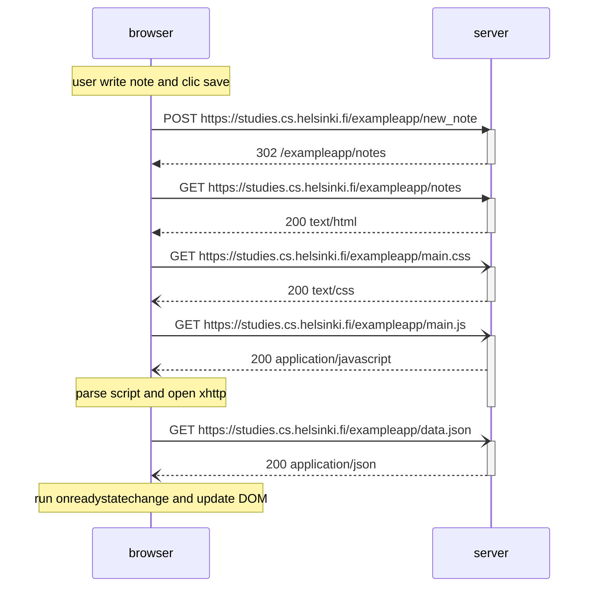

```mermaid
sequenceDiagram
    participant browser
    participant server

    Note over browser: user write note and clic save
    browser->>server: POST https://studies.cs.helsinki.fi/exampleapp/new_note
    activate server
    server-->>browser: 302 /exampleapp/notes
    deactivate server

    browser->>server: GET https://studies.cs.helsinki.fi/exampleapp/notes
    activate server
    server-->>browser: 200 text/html
    deactivate server

    browser-)server: GET https://studies.cs.helsinki.fi/exampleapp/main.css
    activate server
    server--)browser: 200 text/css
    deactivate server

    browser-)server: GET https://studies.cs.helsinki.fi/exampleapp/main.js
    activate server
    server--)browser: 200 application/javascript
    Note over browser: parse script and open xhttp
    deactivate server

    browser-)server: GET https://studies.cs.helsinki.fi/exampleapp/data.json
    activate server
    server--)browser: 200 application/json
    deactivate server
    Note over browser: run onreadystatechange and update DOM
    
    

```