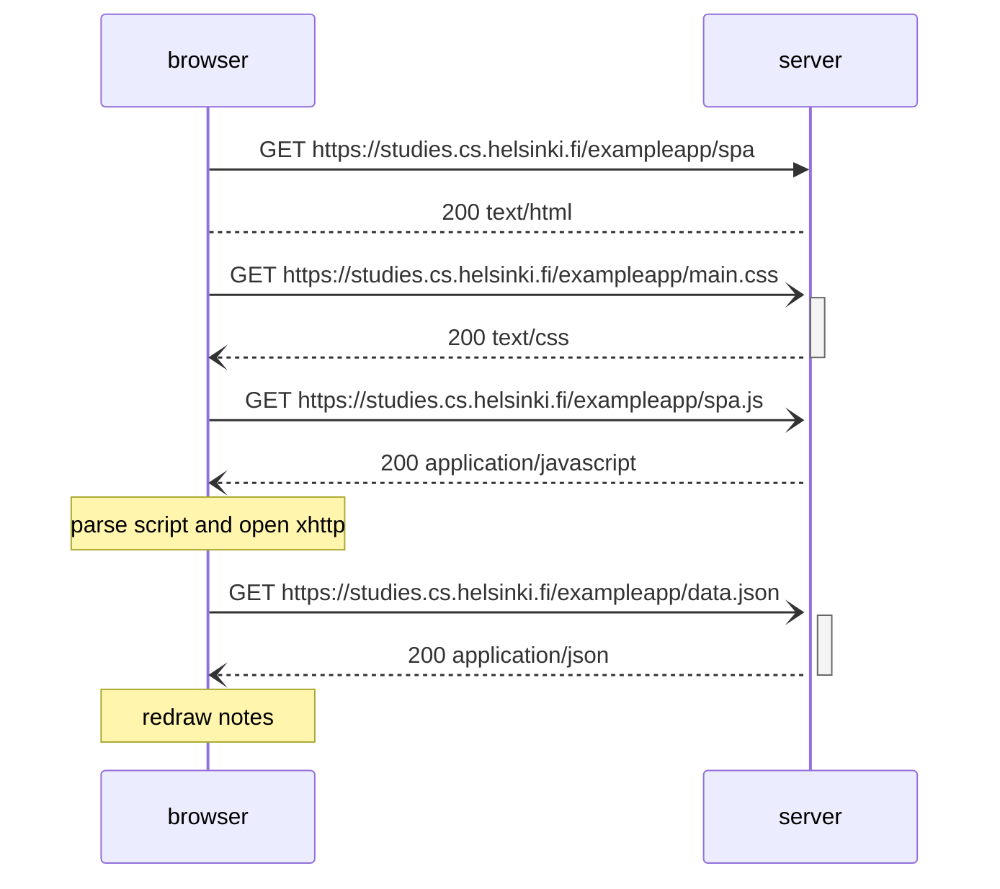

```mermaid
sequenceDiagram
    participant browser
    participant server

    browser->>server: GET https://studies.cs.helsinki.fi/exampleapp/spa
    activate server
    server-->browser: 200 text/html

    browser-)server: GET https://studies.cs.helsinki.fi/exampleapp/main.css
    activate server
    server--)browser: 200 text/css
    deactivate server

    browser-)server: GET https://studies.cs.helsinki.fi/exampleapp/spa.js
    activate server
    server--)browser: 200 application/javascript

    Note over browser: parse script and open xhttp
    browser-)server: GET https://studies.cs.helsinki.fi/exampleapp/data.json
    activate server
    server--)browser: 200 application/json
    deactivate server
    Note over browser: redraw notes
```