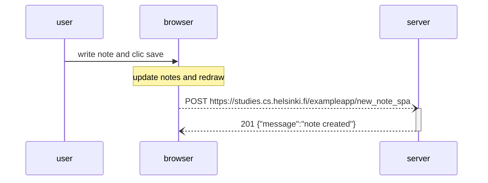

```mermaid
sequenceDiagram
    participant user
    participant browser
    participant server

    
    user ->> browser: write note and clic save
    Note over browser: update notes and redraw
    browser--)server: POST https://studies.cs.helsinki.fi/exampleapp/new_note_spa
    activate server
    server--)browser: 201 {"message":"note created"}
    deactivate server


```